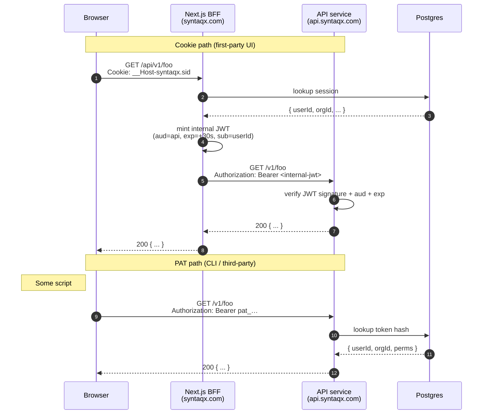

# Auth & identity architecture

> Internal engineering doc. Not published. Captures the design we settled on
> for syntaqx auth so future work (ours or an agent's) doesn't relitigate
> the decisions.

## Status

**Today (May 2026):** UI shell only. There's a "Sign in" button in the
header and a `/login` page that posts to `POST /api/auth/sign-in/email`,
which is a stub that always returns `401 { message: "Invalid email or
password." }`. No database, no real cookies, no users. The URL shape and
form contract match what the real implementation will use so the swap-in
is mechanical.

**Not yet built:** persistence, real sessions, social providers, signup,
email verification, password reset, organizations, PATs, OIDC provider,
BFF→API split. Each is sketched below.

## Goals

- Sessions for the first-party UI, **never JWTs in the browser**.
- Personal Access Tokens (PATs) for non-browser API consumers.
- Symmetric server-side resolution: one helper accepts either a session
  cookie or a `Bearer pat_…` token and produces the same principal.
- Be an OIDC provider for our own future apps (and, eventually, third
  parties) — not a shared-cookie kludge across subdomains.
- Stay portable: when the API is extracted out of this Next.js BFF, the
  browser contract does not change.

## Non-goals

- Storing tokens of any kind in `localStorage` / `sessionStorage` / a
  non-`HttpOnly` cookie. Never.
- Long-lived stateless JWTs presented by the browser. The revocation,
  size-limit, and stale-permissions problems are why we don't.
- Supabase auth, Auth.js's default JWT-session mode, Lucia (deprecated),
  or rolling our own OAuth.

## Identity model

Three credential types, in expected order of how often they appear:

| Credential | Who holds it | How it's sent | Lifetime | Revocable |
|---|---|---|---|---|
| **Session** | A browser on `syntaqx.com` | `Cookie: __Host-syntaqx.sid=…` (httpOnly) | Days, rolling | Yes (delete the row) |
| **PAT** | Scripts, CLIs, third-party apps | `Authorization: Bearer pat_…` | User-chosen (7d → no expiry) | Yes (delete the row) |
| **OIDC access token** *(future)* | A registered OAuth client app | `Authorization: Bearer …` | Short (≤1h), refreshable | Yes |

All three resolve to the same `Principal` shape on the server:

```ts
type Principal = {
  userId: string;
  activeOrgId: string;
  permissions: Permission[];      // effective in active org
  source: "session" | "pat" | "oauth";
  tokenId?: string;               // for PAT / OAuth, for audit
  clientId?: string;              // OAuth only
};
```

## Cookie design

- **Name:** `__Host-syntaqx.sid`
- **Attributes:** `HttpOnly; Secure; SameSite=Lax; Path=/`
- **No `Domain` attribute** — the `__Host-` prefix forbids it. The cookie
  is host-locked to `syntaqx.com`. It is **not** sent to
  `api.syntaqx.com`, `*.syntaqx.com`, or anything else.
- **Value:** opaque random 32-byte ID, base64url-encoded. Server looks
  the row up in the `session` table. No JWT, no signed payload.

The `__Host-` prefix is a browser-enforced safety net: the browser will
refuse a `Set-Cookie` that violates the prefix's rules (`Path=/`,
`Secure`, no `Domain`), so a misconfigured deploy can't accidentally
broaden the cookie's scope.

## How the frontend talks to the API

The frontend uses **same-origin** API calls:

```ts
fetch("/api/v1/me");           // cookie attached, no CORS, no preflight
```

This works because `proxy.ts` routes `syntaqx.com/api/v1/*` to the same
handlers that serve `api.syntaqx.com/v1/*`. Both URLs are front doors to
identical handler code. The same-origin path is faster (no preflight),
simpler (no `credentials: "include"`), and safer (host-locked cookie is
sufficient).

We do **not** support `fetch("https://api.syntaqx.com/v1/me", {
credentials: "include" })` from the browser. That would require a
`Domain=.syntaqx.com` cookie, which broadens the trust boundary to every
subdomain forever. We use PATs and OIDC for non-syntaqx browser origins
instead.

## How non-browser callers talk to the API

PATs over `Authorization: Bearer pat_…`. Works against either hostname,
but the documented surface is `api.syntaqx.com/v1/*`.

PATs are GitHub-style fine-grained:

- A token has a name, an optional expiry, a target org (defaults to
  user's personal org), and an explicit set of permissions chosen from a
  central registry (`lib/permissions.ts` — to be written).
- Token's permissions must be a subset of the user's effective
  permissions in the target org at mint time.
- Token value: `pat_` prefix + random body. The plaintext is shown
  exactly once at creation. The DB stores only a hash + the prefix for
  display.

## Multi-tenancy: orgs from day one

Vercel-style. Every user, on signup, gets a personal organization
auto-created. Teams are organizations with multiple members. Roles:
`owner`, `admin`, `member`, `billing`.

- Active org is tracked on the session (`session.activeOrganizationId`).
- Permissions are computed per-org: `effectivePermissions(userId,
  orgId)` returns the set granted by the user's role in that org.
- PATs target one org and inherit ≤ that org's permissions.

Doing this from day one is cheap (Better Auth's `organization` plugin
ships the schema and APIs) and makes the later "I want teams" or "I want
Okta SSO" pivot a config change rather than a migration.

## Future: be an OIDC provider

When we want syntaqx accounts to sign into a separate app (`tool.com`,
`app.example.com`, or even our own `app.syntaqx.com`), the answer is
**not** a shared cookie across subdomains. The answer is OAuth/OIDC.

Better Auth's OIDC Provider plugin gives us:

- `/.well-known/openid-configuration`
- `/oauth/authorize` (consent screen — reuses the session cookie to
  skip login if the user is already signed into syntaqx)
- `/oauth/token`
- `/oauth/userinfo`
- An admin UI to register client apps, set redirect URIs, scopes.

The flow:

1. `tool.com` redirects browser to
   `https://syntaqx.com/oauth/authorize?client_id=tool&...`.
2. User lands on syntaqx. If session cookie is valid → skip straight to
   consent. Otherwise → `/login` → consent.
3. Consent → redirect back to `tool.com` with auth code.
4. `tool.com` exchanges code for an access token at `/oauth/token`.
5. `tool.com` uses the access token against `api.syntaqx.com`.

The session cookie **never leaves `syntaqx.com`**. The OIDC client app
gets a scoped, revocable token with its own lifecycle. The two
credentials don't overlap.

## BFF → API split (eventual)

The API is currently the same Next.js process as the BFF, routed by
`Host` in `proxy.ts`. When we extract it (Go service, Rust service,
another Node app — TBD), this is the pattern:



### Why a short-lived JWT here (and only here)

This is the **one** place JWTs are appropriate. The token:

- Is minted by the BFF and consumed by the API service, both ours.
- Lives ≤30 seconds, well below any plausible revocation window.
- Is never seen by the browser.
- Carries `{ iss, aud, sub: userId, org: activeOrgId, scopes, iat, exp,
  jti }` and is signed with a shared secret (HS256) or a key pair
  (RS256/EdDSA) rotated through a JWKS endpoint when we care to.

If we ever need to revoke mid-request, the API service can also look
up the user in the same Postgres to confirm they aren't banned — but
the short TTL means we don't need to in the hot path.

### Why not just forward the session cookie?

The API service shouldn't know about syntaqx's session cookie format
(it's a BFF implementation detail), and shouldn't share the session
table as its primary auth surface (couples deployment). The JWT is the
contract; everything on the BFF side of it can change.

### Shared identity store

Day one of the split, the API service shares the same Postgres for
user/org/PAT lookups. If/when the API service needs its own data store,
identity stays in a service the BFF and API both read (or behind an
introspection endpoint). Don't fork the user table.

## Stack

- **Postgres: Neon.** Serverless-native, HTTP driver for edge, Vercel
  preview branches.
- **ORM: Drizzle.** Type-safe, no codegen daemon, edge-compatible.
- **Auth library: Better Auth.** Sessions-first (DB, not JWT), ships the
  Organization, API Keys, and OIDC Provider plugins that match this
  doc nearly 1:1.
- **Email: Resend.** Verification, password reset, team invitations.

### Alternatives considered

- **Supabase auth:** uses the client-JWT pattern this doc rejects.
  Using Supabase as just Postgres is fine; using its auth is fighting
  the product.
- **Auth.js v5:** defaults to JWT sessions, treats DB sessions as a
  second-class config. Workable but the grain is wrong for us.
- **Lucia:** effectively deprecated.
- **Roll our own OAuth + CSRF + account linking + orgs:** no.

## CORS

Currently `Access-Control-Allow-Origin: *` in `proxy.ts`. This is fine
while no auth state exists. The moment the cookie is real, this changes
to an **allowlist when credentials are involved**:

```
Origin allowlist (credentialed):
  https://syntaqx.com
  https://*-syntaqx.vercel.app   (preview pattern)
  http://localhost:3000          (dev only)
```

Non-credentialed requests (PAT callers) keep working from any origin
because they don't send cookies — they send `Authorization`.

## Permission registry (sketch)

`lib/permissions.ts` will hold the union of all permissions, grouped for
the PAT UI:

```
read:user       write:user
read:org        write:org      admin:org
read:posts      write:posts
admin:tokens
```

A `Role` is a named set of permissions; a `User` has a `Role` per org;
a `PAT` carries an explicit subset.

## Phasing

1. **Done.** Login UI shell + 401 stub.
2. **Next.** Neon + Drizzle + Better Auth core; GitHub OAuth + email +
   password; orgs plugin; personal org auto-created on signup; the
   header becomes a session-aware `UserMenu`; `/api/v1/me` is the first
   protected route.
3. **Then.** PAT UI (`/settings/tokens`), permission registry, unified
   `getPrincipal()`, CORS lockdown in `proxy.ts`.
4. **Later.** OIDC Provider plugin, SAML/Okta plugin, audit log.
5. **Eventually.** BFF→API service split per the diagram above.

## Decisions log

- **Sessions, not browser-held JWTs.** Revocation, permission freshness,
  cookie-size limits are all unsolved problems with stateless tokens.
- **Host-locked `__Host-` cookie.** Subdomain trust is a forever
  commitment; we'd rather earn it explicitly via OIDC per app.
- **Same-origin `/api/v1/*` from the frontend.** The `api.syntaqx.com`
  hostname is for non-browser callers (PATs) and future OIDC clients.
- **PATs are GitHub-style fine-grained from day one.** The registry can
  grow; the *shape* (scoped tokens, not full-account) is the
  commitment.
- **Orgs from day one.** Cheaper now than a schema migration later.
- **Short-lived signed JWT only on the BFF→API hop.** Server-to-server,
  ≤30s, never seen by the browser.
- **Better Auth.** Sessions-first + plugins for orgs/PATs/OIDC matches
  this design. Auth.js's JWT default doesn't.
- **Neon, not Supabase.** Avoids fighting Supabase's auth model.
- **Repo-only docs.** This file lives in `docs/`, not `content/docs/`
  or `app/docs/` — it's an engineering artifact, not site content.
